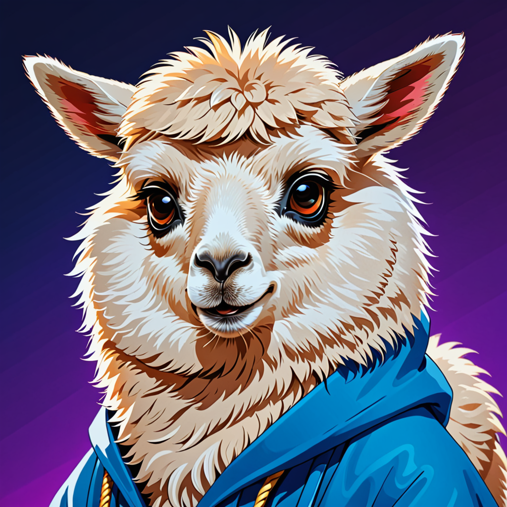

# LlamaVerse 🪄✨: VSCode Edition



*Enter the LlamaVerse and chat with Ollama models directly in your VS Code editor!*

## Features

- Connect to your local Ollama instance
- Choose from available Ollama models
- Chat with AI models in a dedicated VS Code webview

## Requirements

- VS Code 1.60.0 or higher
- Ollama installed and running on your local machine

## Installation

1. Install the extension from the VS Code Marketplace
2. Ensure Ollama is installed and running on your machine
3. Run the following command on terminal
   ```bash
   Ollama serve
   ```

## Usage

1. Open the Command Palette (Ctrl+Shift+P)
2. Type "Start LlamaVerse Chat" and select the command
3. Choose your desired Ollama model from the dropdown
4. Start chatting!

## Known Issues

- The extension currently only works with Ollama running on localhost
- Limited error handling for network issues

## Release Notes

### 0.1.0

Initial release of LlamaVerse: VSCode Edition

---

## For more information

* [Ollama Official Website](https://ollama.ai/)
* [VS Code Extension API](https://code.visualstudio.com/api)

## Stay Connected

I regularly update my [Twitter](https://twitter.com/appyzdl5) and [Substack](https://appyzdl5.substack.com/) with insights and discussions on computer science, machine learning, and deep learning. Follow me for the latest news, updates, and articles on these exciting fields!

- **Twitter:** [@appyzdl5](https://twitter.com/appyzdl5)
- **Substack:** [Subscribe here](https://appyzdl5.substack.com/)

Stay tuned for more content and updates!


**Enjoy your journey through the LlamaVerse!**